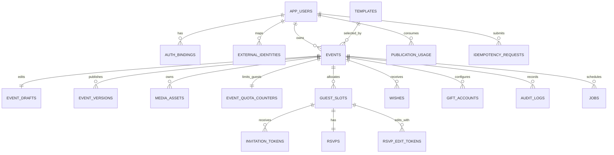
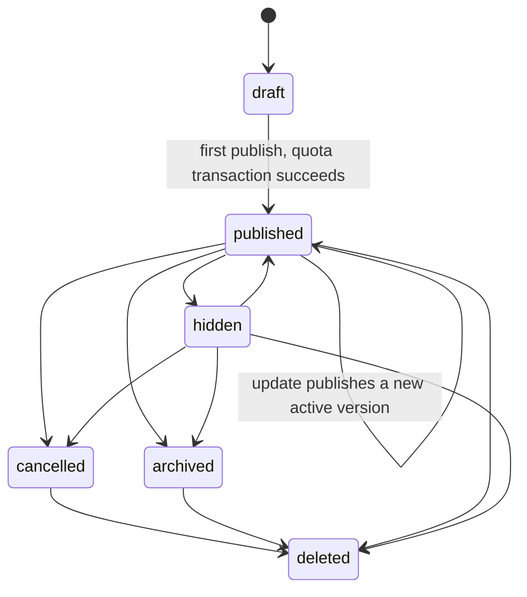

# G0 — Mô hình dữ liệu, state machine và ranh giới truy cập

## ERD logic

## Bảng tối thiểu và khóa quan trọng

| Bảng | Khóa/chỉ mục bắt buộc | Mục đích |
|---|---|---|
| `app_users` | `id` UUID PK | Identity nội bộ bền vững. |
| `auth_bindings`, `external_identities` | unique provider + subject; FK `app_user_id` | Binding auth không thay ownership. |
| `templates` | `id`, version, enabled-for-new flag | Renderer/theme có version. |
| `events` | `id`; FK `owner_app_user_id`; unique `public_code` | Lifecycle, mã link chung, cấu hình. |
| `event_drafts` | unique `event_id`; integer `revision` | Nội dung mutable/optimistic concurrency. |
| `event_versions` | `id`; unique `(event_id, version_number)`; một active/version event | Snapshot published bất biến. |
| `media_assets` | FK `event_id`; status; owner-scoped storage key | Media tạm/xử lý/sẵn sàng. |
| `publication_usage` | unique `(app_user_id, vietnam_month)` | Chặn hơn một publish đầu/tháng. |
| `event_quota_counters` | unique `event_id`; check `guest_slots_used between 0 and 50` | Counter giao dịch cho mọi nguồn khách. |
| `guest_slots` | FK `event_id`; allocation source; revoked/deleted timestamp | Đơn vị quota khách, không phải companion. |
| `invitation_tokens` | token hash unique; FK guest | Link cá nhân; chỉ hash để lookup. |
| `rsvps` | unique `guest_slot_id` | Phản hồi hiện hành. |
| `rsvp_edit_tokens` | token hash unique; FK RSVP/guest; expiry/revoked | Bí mật sửa RSVP link chung. |
| `wishes`, `gift_accounts` | FK `event_id`; gift tối đa 2 enforced server/DB | Lời chúc và cấu hình quà private. |
| `idempotency_requests` | unique `(app_user_id, route, idempotency_key)` | Hash payload + response đã commit. |
| `jobs`, `audit_logs`, `event_metrics_daily`, `abuse_reports` | actor/event FK khi áp dụng | Vận hành, retry, truy vết và metrics không PII. |

## Trạng thái và chuyển đổi

`events.public_version_id` chỉ thay sau preflight, OG candidate thành công và transaction quota/activation đã commit. Không mở transaction database trong khi tạo OG.

## Ranh giới dữ liệu và authorization

| Bề mặt | Actor | Dữ liệu/phép truy cập |
|---|---|---|
| Public event route | `anon` | Chỉ snapshot active của event `published`, dữ liệu renderer đã lọc và metadata/OG an toàn. |
| Personal RSVP route | Token hợp lệ | Event public + guest đúng token; chỉ được sửa RSVP của guest đó. |
| Shared RSVP route | `anon` + anti-abuse | Đọc form public tối thiểu; tạo guest/RSVP qua transaction. Không có lookup theo điện thoại. |
| Owner API | Supabase session → `app_user_id` | Chỉ event owner; draft, guest, RSVP, media, export, gift config. |
| Worker/service | Service role server-only | Jobs có lease, audit và check scope; không bao giờ ở bundle/browser. |

### Chính sách RLS yêu cầu

- `anon` không được `SELECT` trực tiếp các bảng `guest_slots`, `rsvps`, `event_drafts`, `invitation_tokens`, `rsvp_edit_tokens`, `gift_accounts`, `audit_logs`, `idempotency_requests`.
- User đã đăng nhập chỉ được CRUD row có `events.owner_app_user_id = current_app_user_id()`; mọi bảng con phải kiểm tra ownership qua event, không tin `event_id` do client đưa.
- Public read không đi qua base table private. Dùng Route Handler/server DTO hoặc view/RPC security-definer được review riêng, trả đúng field allowlist.
- RPC cấp quota/publish dùng transaction, khóa counter/bucket cần thiết và kiểm tra actor owner ở trong transaction.

## Dữ liệu công khai tối thiểu (`PublicEventDTO`)

`publicCode`, `version`, `template`, `theme`, `title`, `hosts`, `schedule`, `locations`, các section đã bật, URL biến thể media public đã xử lý và cờ hiển thị RSVP/quà/lời chúc. Tuyệt đối không gồm ID guest, số điện thoại, nội dung nháp, token, email owner, audit data, account id hay thông tin ngân hàng.

## Lifecycle media và retention

`uploaded → processing → ready | failed`. Chỉ media `ready` mới được xuất bản. Temp file dọn sau 24 giờ; original đã xử lý sau 7 ngày khi đã giữ đủ variants; event public tự lưu trữ sau 180 ngày kết thúc; PII RSVP giữ tối đa 12 tháng. Account deletion ẩn thiệp ngay và job dọn dữ liệu chính trong 30 ngày.
